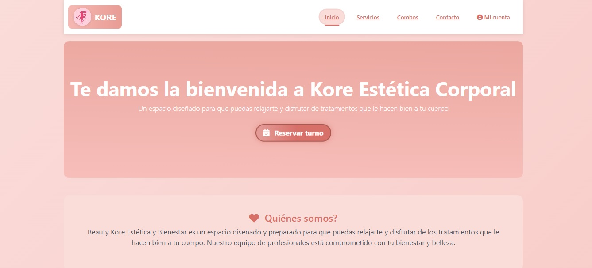
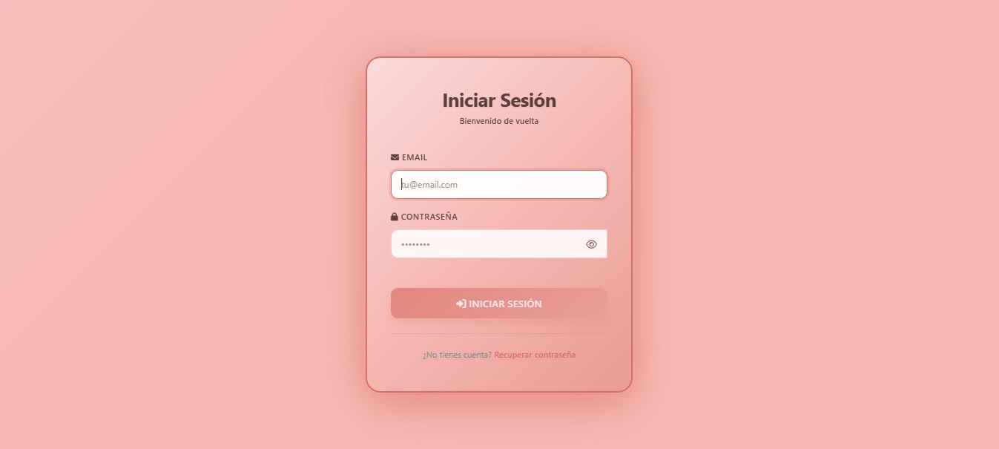
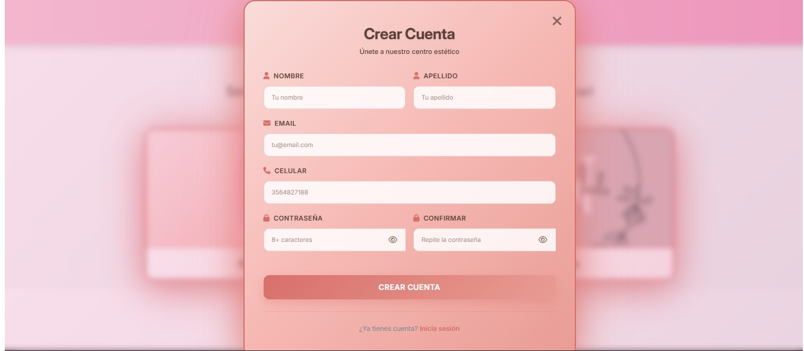
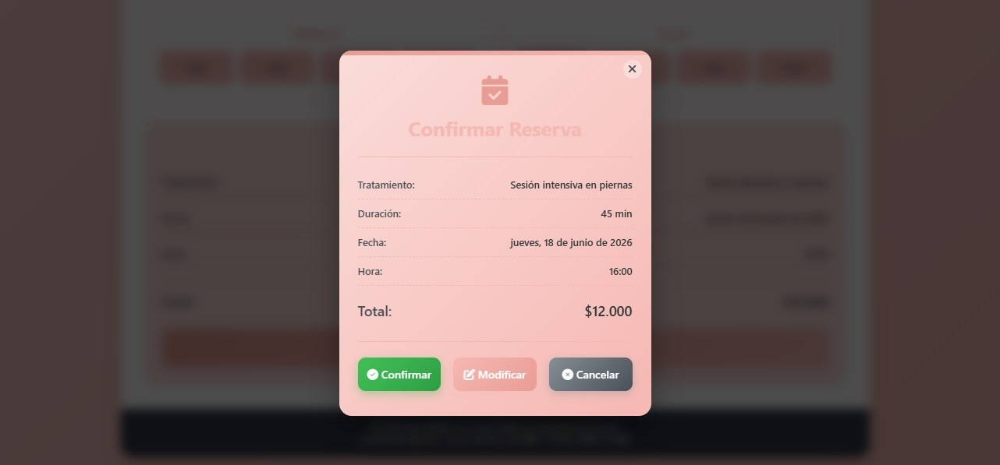
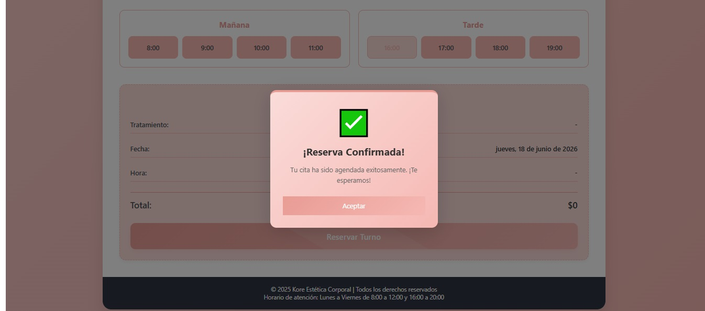
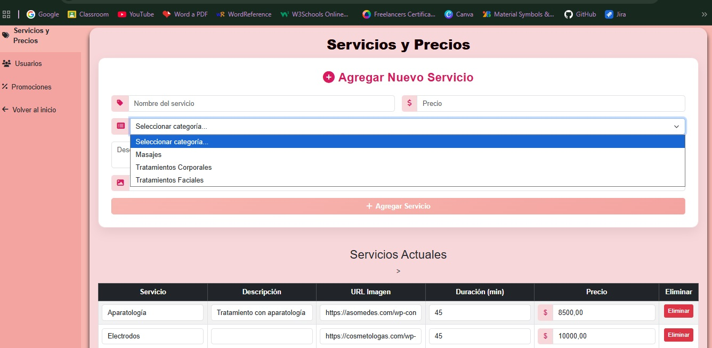
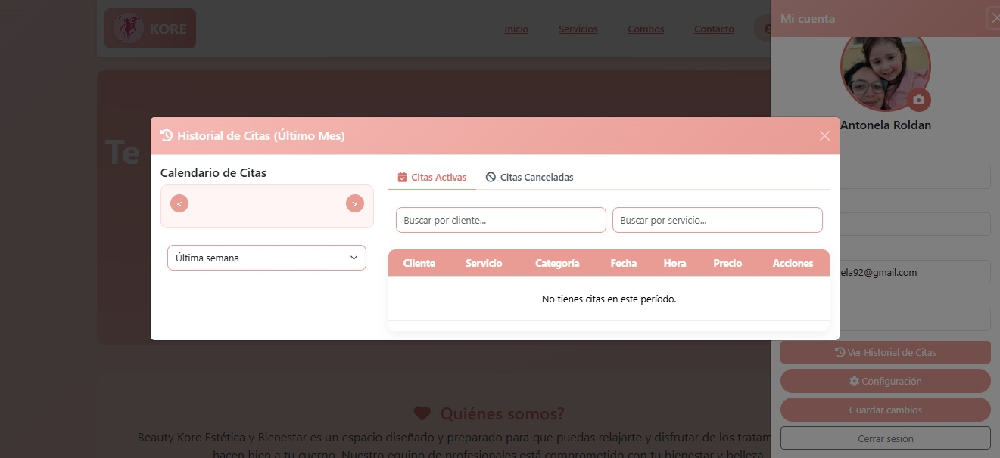

Centro Estética Web

Sistema web desarrollado para la gestión de centros de estética, permitiendo la administración de usuarios, servicios y reservas de turnos.

Tecnologías utilizadas:

* PHP
* MySQL
* HTML
* CSS
* JavaScript
* XAMPP

Funcionalidades principales:

* Registro e inicio de sesión de usuarios
* Reserva de turnos online
* Gestión de tratamientos y promociones
* Panel de administración
* Gestión de usuarios
* Historial de citas
* Configuración de la plataforma

Mi participación:

* Relevamiento de requisitos con cliente real
* Entrevistas para obtención de requerimientos
* Diseño de funcionalidades
* Desarrollo full stack
* Diseño y gestión de base de datos
* Testing y validación de funcionalidades
* Documentación del proyecto

Capturas del sistema:

### Página principal

### Inicio de sesión

### Registro de usuarios

### Reserva de turnos

### Turno confirmado

### Panel de administración

### Historial de citas

## Base de datos

El proyecto incluye el script SQL para la creación de la base de datos:

* esteticadb.sql

